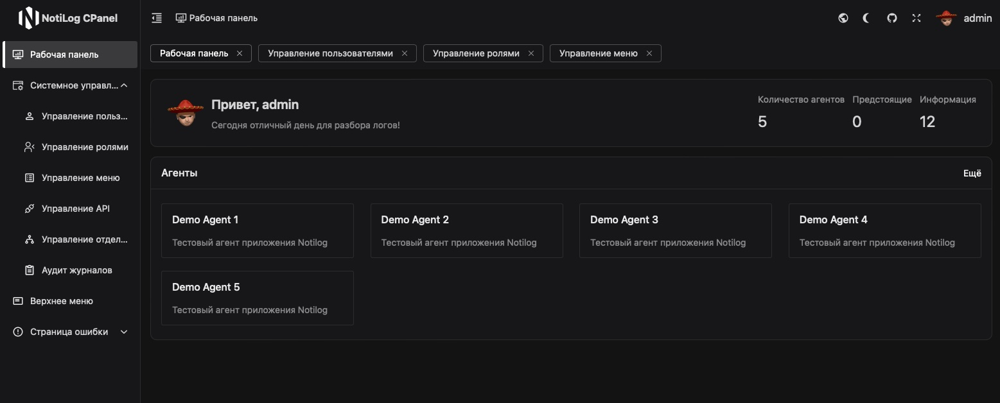

# Добро пожаловать в NotiLog!
Notilog — открытая cистема управления журналами приложений, мониторингом процессов, отправкой уведомлений и эскалацией инцидентов.

## Основные возможности NotiLog

### Быстрое развертывание и легкая интеграция
Система легко разворачивается на любой платформе — от облачных сервисов до локальных установок. Поддержка интеграции с любыми источниками логов, включая файлы и базы данных, позволяет быстро внедрить систему в вашу IT-инфраструктуру с минимальными усилиями.

### Управление событиями и мгновенные уведомления
Удобный интерфейс управления событиями в реальном времени позволяет быстро реагировать на изменения. Система мгновенных уведомлений поддерживает отправку через Telegram, Kafka и email, обеспечивая доставку критичной информации через нужные каналы.

### Эскалация инцидентов и мониторинг
Система обеспечивает автоматическое управление инцидентами, мгновенно реагируя на критические события и уведомляя нужных специалистов. Постоянный мониторинг процессов и приложений позволяет выявлять потенциальные проблемы до того, как они начнут оказывать негативное влияние на бизнес.

### Serverless-режим
Есть поддержка serverless-режима, позволяющего мгновенно начать мониторинг без необходимости настройки собственной инфраструктуры. В этом режиме вы можете использовать наш бесплатный сервер для временного хранения логов и автоматической отправки уведомлений по вашим настроенным каналам.

### Бесперебойность и надёжное управление доступом
Поддержка обновлений в реальном времени позволяет системе продолжать работу без необходимости перезагрузки, минимизируя простои. Гибкая система управления доступом обеспечивает защиту данных и контроль за действиями пользователей в зависимости от их ролей и обязанностей.

### Аналитика и дашборды
Интерактивные дашборды позволяют отслеживать ключевые метрики и анализировать производительность систем в реальном времени. Это помогает оперативно принимать взвешенные решения на основе актуальных данных.

## Сообщество

Участие в сообществе NotiLog предоставляет вам прямой путь к установлению связей с другими единомышленниками. Узнайте больше о том, как вы можете участвовать в нашем сообществе, ознакомившись с нашим [руководством по сообществу](https://github.com/ForceFledgling/notilog/blob/main/docs/_guides/community.md).

## Лицензия

NotiLog является программным обеспечением с открытым исходным кодом и лицензируется по условиям лицензии [MIT License](https://github.com/ForceFledgling/notilog/blob/main/LICENSE).